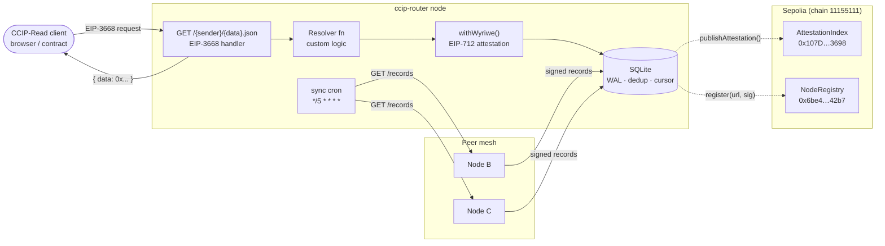
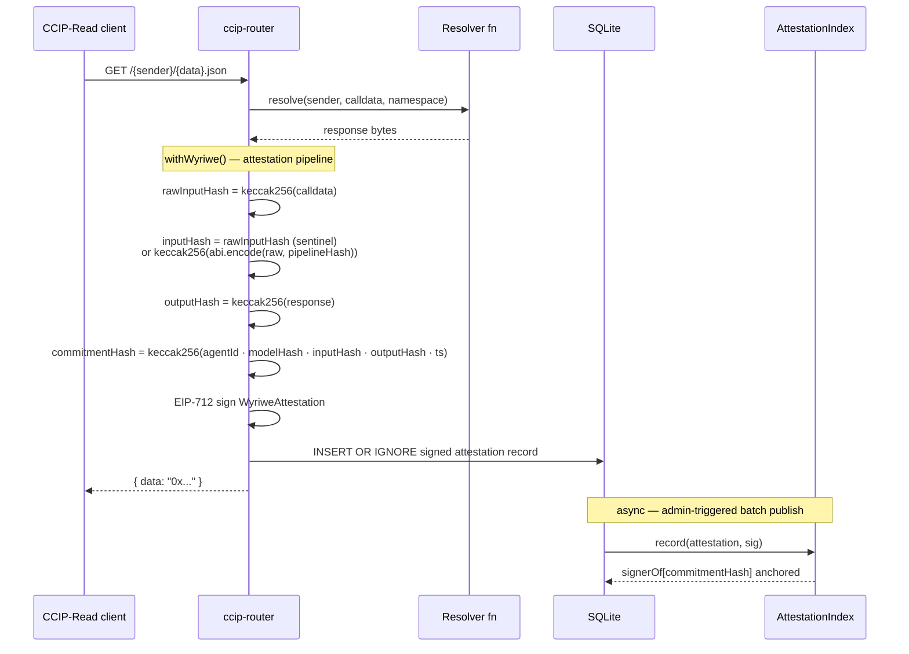
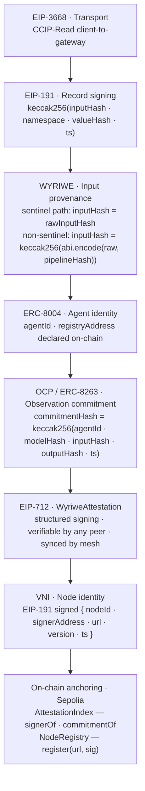

# ccip-router

**The coordination layer CCIP-Read was missing.**

EIP-3668 defines how clients talk to CCIP-Read gateways. It says nothing about how gateways talk to each other. `ccip-router` fills that gap — peer sync, deduplication, signed records, and cryptographic attestation for any CCIP-Read gateway.

No ENS required. No agents required. Any CCIP-Read project can plug in a resolver and get a mesh-ready gateway in minutes.

**→ [Integration guide](GUIDE.md)** — install, quickstart, attestation setup, contracts, mesh join.

---

## What you can build

ccip-router is a general-purpose CCIP-Read gateway. The resolver function is yours — the mesh, signing, and attestation pipeline come wired up around it.

**ENS name resolution**
Point an ENS `wildcard` or `offchainLookup` resolver at your gateway. ccip-router handles the EIP-3668 `/{sender}/{data}.json` endpoint, signs every response, and replicates it to peer nodes — so your ENS names stay live even if one gateway goes down.

**Native full web3 dapps**
Pin your app's pages as IPFS CIDs and set them as the ENS contenthash — the frontend has no server to take down. Serve dynamic data through ccip-router: any node in the mesh can answer a CCIP-Read request, so if one goes offline the others keep the app running. The ENS name ties both layers together on-chain. The result is a dapp with no single point of failure at either the frontend or the data layer.

**Off-chain data for on-chain contracts**
Any smart contract that uses `OffchainLookup` can delegate reads to ccip-router. Store token metadata, user profiles, game state, or permit trees off-chain and serve them through a verifiable gateway rather than a trusted API.

**Audit trail for AI agents**
Wrap an AI inference function with `withWyriwe()`. Every call gets a cryptographic receipt: what input the agent received, what model processed it, what it returned — EIP-712 signed and replicated across the mesh. Useful anywhere you need a tamper-evident log of AI output (legal, compliance, multi-agent workflows).

**Model Context Protocol (MCP) gateway**
Run ccip-router as the transport layer for an MCP server. Tool calls arrive as CCIP-Read requests; attestations prove what the model saw and returned. Any peer can verify a past call without trusting your node.

**Redundant resolver mesh**
Run the same namespace across multiple nodes. Records sync every five minutes over `GET /records`. If one node goes offline its records are already on the others — no single point of failure, no custom failover logic.

**Any verifiable off-chain lookup**
If your contract needs off-chain data and you want proof it wasn't tampered with, ccip-router gives you the signed record, the peer-replicated history, and an optional on-chain anchor — all from a single resolver function.

---

## Architecture

### System overview



### Per-request attestation flow



### Attestation stack



---

## Contracts

Both contracts are permissionless — no owner, no admin. One deployment per chain serves all nodes.

| Contract | Sepolia address | Purpose |
|---|---|---|
| `AttestationIndex` | [`0x107D706112225aC57eCf6692FBbDC283fb6E3698`](https://sepolia.etherscan.io/address/0x107D706112225aC57eCf6692FBbDC283fb6E3698) | Anchors EIP-712 `WyriweAttestation` records on-chain. Stores `signerOf[commitmentHash]` and `commitmentOf[inputHash]`. |
| `NodeRegistry` | [`0x6be4966596A9CBaa7260ab6EbbFFA69bBC9a42b7`](https://sepolia.etherscan.io/address/0x6be4966596A9CBaa7260ab6EbbFFA69bBC9a42b7) | Public directory of nodes. `register(url, sig)` proves key ownership via EIP-191 — the relayer (`msg.sender`) does not need to be the signing key. |
| `WyriweAttestationVerifier` | [`0x9515D6e53D2D45C1CFE6181943ca11C150C2bf61`](https://sepolia.etherscan.io/address/0x9515D6e53D2D45C1CFE6181943ca11C150C2bf61) | ERC-8183 `IAttestationVerifier` implementation. `verify(commitmentHash, abi.encode(WyriweAttestation, sig))` — recovers signer, recomputes OCP commitment, returns bool. No external calls. |

Deployed by [`0xFf9a176577Fb42b6bc9c19fd05a241e8fCd0ca14`](https://sepolia.etherscan.io/address/0xFf9a176577Fb42b6bc9c19fd05a241e8fCd0ca14) · Solc 0.8.24 · optimizer 200 runs.

**To use on Sepolia:** open the admin panel → Deploy contracts → select Sepolia → "Use these addresses →". Addresses are saved to config automatically, no deployment needed.

**To deploy to another chain:** open the admin panel → Deploy contracts → select the chain → connect wallet → three transactions (one per contract). No private key is stored — MetaMask signs everything in-browser.

Source: [`contracts/AttestationIndex.sol`](contracts/AttestationIndex.sol) · [`contracts/NodeRegistry.sol`](contracts/NodeRegistry.sol) · [`contracts/WyriweAttestationVerifier.sol`](contracts/WyriweAttestationVerifier.sol)

---

## Two tiers

### Basic — plug in a resolver, get a gateway + mesh

```typescript
import { CcipRouter } from 'ccip-router'

const ccip = new CcipRouter({
  namespace: 'token-metadata',
  db,
  gatewayKey: process.env.GATEWAY_PRIVATE_KEY,
  resolver: async (sender, calldata, namespace) => {
    return encodeMyResponse(calldata)
  },
})

app.route('/', ccip.hono())
```

What you get:
- CCIP-Read handler (`/{sender}/{data}.json`)
- EIP-191 signed records written to SQLite on every call
- Mesh peer sync (`GET /records?since=&namespace=&limit=&cursor=`)
- Record deduplication — same `inputHash` never inserted twice
- Admin dashboard at `/admin` with peer management + sync controls
- Setup wizard at `/setup` on first boot

### ENS — built-in wildcard resolver

`withEns()` decodes `resolve(bytes name, bytes data)` calldata (EIP-137 wildcard pattern), dispatches to a clean handler, and ABI-encodes the response. DNS wire-format, selector dispatch, and null-to-zero-value fallbacks are handled for you.

```typescript
import { CcipRouter, withEns } from 'ccip-router'
import type { EnsResolverFn } from 'ccip-router'

const resolver: EnsResolverFn = async (name, record) => {
  // name   → "vitalik.eth"
  // record → { type: 'addr' } | { type: 'addr', coinType: 60n }
  //           { type: 'text', key: 'avatar' } | { type: 'contenthash' }
  return db.lookup(name, record) // return string or null
}

const ccip = new CcipRouter({
  namespace: 'ens-offchain',
  db,
  gatewayKey: process.env.GATEWAY_PRIVATE_KEY,
  resolver: withEns(resolver),
})
```

**Standalone mode:** ENS records are managed from the admin panel ("ENS Records" panel — no code required). Any name pointing to this gateway via an on-chain CCIP-Read wildcard resolver is served automatically.

**Compose with attestation:**
```typescript
resolver: withWyriwe(withEns(resolver), attestationOpts)
```

Use `isEnsCalldata(calldata)` to safely gate `withEns()` in a multi-purpose resolver that also handles non-ENS calldata.

---

### Advanced — wrap any resolver with WYRIWE EIP-712 attestation

```typescript
import { CcipRouter, withWyriwe } from 'ccip-router'

const ccip = new CcipRouter({
  namespace: 'agent-attestations',
  db,
  gatewayKey: config.gatewayKey,
  resolver: withWyriwe(myAgentResolver, {
    gatewayKey:       config.gatewayKey,
    registryAddress:  process.env.REGISTRY_ADDRESS as `0x${string}`,
    agentId:          process.env.AGENT_ID as `0x${string}`,
    modelHash:        process.env.MODEL_HASH as `0x${string}`,
    chainId:          1,
    // sanitizationCID: 'ipfs://Qm...',  // omit for sentinel (identity) path
  }),
})
```

What `withWyriwe()` adds on top of basic:
- Triple-hash chain — two paths:
  - **Sentinel** (default): `sanitizationPipelineHash = keccak256("IDENTITY_SENTINEL")`, `inputHash = rawInputHash`
  - **Non-sentinel** (`sanitizationCID` set): `sanitizationPipelineHash = keccak256(CID)`, `inputHash = keccak256(abi.encode(rawInputHash, sanitizationPipelineHash))`
- EIP-712 `WyriweAttestation` signed with the gateway key on every resolver call
- Attestation records persisted to `{namespace}:wyriwe` — synced by the mesh automatically
- Verifiable by any peer: recover signer from signature, match against known gateway address

---

## Quick start (setup wizard)

```bash
npm install
npm run dev
# → open http://localhost:3000/setup
# → step 1: generate or import your signing key
# → step 2: optional Bearer secret for CLI access
# → step 3: namespace, port, sync interval
# → step 4: confirm → config.json written, node restarts
# → /admin/login: connect any MetaMask wallet → first signer claims admin
# → /admin: dashboard ready
```

Or configure via environment (no wizard needed):

```bash
cp .env.example .env
# set GATEWAY_PRIVATE_KEY, ADMIN_SECRET, PEERS, etc.
npm run dev
```

---

## Environment variables

| Variable | Required | Default | Description |
|---|---|---|---|
| `GATEWAY_PRIVATE_KEY` | Yes* | — | 32-byte hex signing key (`0x...`). Without it the node runs in dry-run mode (unsigned records). |
| `ADMIN_SECRET` | No | — | Protects `/admin`. Set for any non-local deployment. Without it the dashboard is open. |
| `PORT` | No | `3000` | HTTP port |
| `DB_PATH` | No | `./data.db` | SQLite file path |
| `SYNC_NAMESPACE` | No | `agent-attestations` | Record namespace — peers must match |
| `SYNC_INTERVAL` | No | `*/5 * * * *` | Cron expression for peer sync |
| `PEERS` | No | — | Comma-separated peer URLs |
| `AGENT_ID` | No | — | ERC-8004 agent identity (bytes32 hex). Enables `/identity` endpoint. |
| `REGISTRY_ADDRESS` | No | — | ERC-8004 on-chain registry address. Required alongside `AGENT_ID`. |
| `CHAIN_ID` | No | `1` | Chain where the ERC-8004 registry is deployed. |
| `ATTESTATION_INDEX` | No | — | Deployed `AttestationIndex` contract address. Enables on-chain anchoring. |
| `NODE_REGISTRY` | No | — | Deployed `NodeRegistry` contract address. Enables on-chain node registration. |
| `RPC_URL` | No | — | JSON-RPC endpoint. Required alongside `ATTESTATION_INDEX`. |
| `MODEL_HASH` | No | — | `keccak256` of model weights CID. Required to activate WYRIWE attestation. |

\* Can also come from `config.json` written by the setup wizard.

---

## Admin dashboard

Visit `/admin` after setup. Features:
- Live stats: record count, peer count, last sync time
- Peer panel: add/remove peers, per-peer health + signer address + last sync
- Recent records panel: local vs peer-synced, timestamps
- ENS records panel — add/edit/delete addr, text, contenthash records without a restart
- Manual sync trigger
- Auto-refresh every 15 seconds

**Auth — claim on first login (EIP-4361 SIWE):** On a fresh node the login page shows an amber "Unclaimed node" banner. Connect any browser wallet and sign once — that wallet address is saved to `config.json` as the permanent admin. Subsequent logins must match that address. Admin wallet is completely decoupled from the gateway signing key (`GATEWAY_PRIVATE_KEY` stays server-side).

**Transfer admin:** While logged in, open the "Admin wallet" panel → Transfer. Switch MetaMask to the new wallet, sign a transfer message to prove ownership — `adminAddress` is updated live and a new session is issued, no restart required.

**Bearer fallback:** `Authorization: Bearer <ADMIN_SECRET>` always works for CLI / scripts regardless of SIWE state.

**Stack status row:** A compact pill row below the header shows which tiers are active — Signing / ERC-8004 / WYRIWE / OCP / VNI / On-chain — derived from `/admin/api/status`. Green = active, grey = unconfigured.

**Node logs panel:** Live ring buffer of the last 200 log lines (info/warn/error), colour-coded. Auto-refreshes every 10 seconds.

---

## Two-node local test

Uses Hardhat dev keys — safe for local testing only, **never use in production**.

### Option A — two terminals

**Terminal 1 — node A**
```bash
PORT=3001 DB_PATH=./node-a.db \
  GATEWAY_PRIVATE_KEY=0xac0974bec39a17e36ba4a6b4d238ff944bacb478cbed5efcae784d7bf4f2ff80 \
  PEERS=http://localhost:3002 SYNC_INTERVAL="*/1 * * * *" \
  npm run dev
```

**Terminal 2 — node B**
```bash
PORT=3002 DB_PATH=./node-b.db \
  GATEWAY_PRIVATE_KEY=0x59c6995e998f97a5a0044966f0945389dc9e86dae88c7a8412f4603b6b78690d \
  PEERS=http://localhost:3001 SYNC_INTERVAL="*/1 * * * *" \
  npm run dev
```

### Option B — Docker

```bash
docker compose up --build
```

### Verify mesh sync

```bash
# trigger a CCIP call on node A — writes a signed record
curl http://localhost:3001/0xf39Fd6e51aad88F6F4ce6aB8827279cffFb92266/0xdeadbeef

# check node A recorded it
curl http://localhost:3001/health | jq .records  # → 1

# wait ~1 minute for sync cron, then check node B
curl http://localhost:3002/health | jq .records  # → 1 (synced from A)

# verify by inputHash on node B
curl http://localhost:3002/verify/<inputHash>
```

---

## API reference

### CCIP-Read handler
```
GET /{sender}/{data}.json
→ { data: "0x..." }        EIP-3668 response
```

### Mesh sync (any peer can pull this)
```
GET /records?namespace=<str>&since=<unix>&limit=<n>&cursor=<str>
→ {
    protocol: 1,
    node_version: "0.2.0",
    namespace: "agent-attestations",
    records: [{ inputHash, namespace, key, value, timestamp, signature, sourcePeer }],
    cursor: "<next>" | null
  }
```

### OCP observation commitment (ERC-8263)
```
GET /ocp/:inputHash
→ {
    inputHash,
    found: true,
    commitmentHash: "0x...",
    observation: { agentId, modelHash, inputHash, outputHash, timestamp },
    namespace, sourcePeer
  }
→ { inputHash, found: false }   (404 — no WYRIWE attestation for this inputHash)
```

### Attestation lookup
```
GET /verify/:inputHash
→ {
    inputHash,
    found: true,
    proofs: [
      {
        namespace:   "agent-attestations",
        signingType: "EIP-191",
        verified:    true,
        signer:      "0x...",
        signature:   "0x...",
        timestamp:   1234567890,
        sourcePeer:  null | "https://..."
      },
      {
        namespace:   "agent-attestations:wyriwe",
        signingType: "EIP-712 WyriweAttestation",
        verified:    true,
        signer:      "0x...",
        signature:   "0x...",
        timestamp:   1234567890,
        attestation: { agentId, registry, modelHash, rawInputHash,
                       sanitizationPipelineHash, inputHash, outputHash }
      }
    ]
  }
→ { inputHash, found: false }   (404)
```

### Identity (ERC-8004)
```
GET /identity
→ { declared: true, agentId, registryAddress, chainId, namespace, signerAddress }
→ { declared: false }   (404 — AGENT_ID not configured)
```

### Node identity (VNI)
```
GET /vni
→ { nodeId, signerAddress, url, version, timestamp, signature }
→ { declared: false }   (404 — NODE_URL not configured)
```

### Peer gossip
```
GET /peers
→ { protocol: 1, node_version, signerAddress, peers: [{ url, signerAddress, healthy, lastSyncAt }] }
```

### Contributions (ERC-8275)
```
GET /contributions
→ { namespace, contributions: [{ source, records }] }
```

### Health
```
GET /health
→ {
    ok, version, namespace, signerAddress,
    identity: { agentId, registryAddress, chainId } | null,
    tiers: { signed, erc8004, wyriwe, ocp },
    peers, records
  }
```

### Admin auth (SIWE + Bearer)
```
GET  /admin/siwe/nonce          → { nonce, domain, chainId, authorizedAddress, claimed }
POST /admin/siwe/verify         { message, signature }
                                  unclaimed node → first caller claims admin, saved to config.json
                                  claimed node   → must match stored adminAddress
                                  → { ok, address, claimed, redirect }
POST /admin/siwe/transfer       { message, signature } — signed by NEW wallet
                                  current session required; updates adminAddress live
                                  → { ok, address }
POST /admin/logout              clear session cookie
```

### Admin API (requires auth)
```
GET  /admin/api/status          node info, peers, recent records, tiers, adminAddress
GET  /admin/api/logs            last 200 log lines [{ ts, level, msg }]
GET  /admin/api/audit           per-spec compliance report (EIP-3668/WYRIWE/ERC-8004/OCP/VNI)
POST /admin/api/sync            trigger immediate peer sync
POST /admin/api/publish         batch-publish recent WYRIWE records to AttestationIndex
                                  body: { limit?: number }  (default 50, max 200)
                                  → { published, skipped, errors }
POST /admin/api/peers           { url } — add peer
DEL  /admin/api/peers           { url } — remove peer
GET  /admin/api/ens-records     ?name= — list ENS records
POST /admin/api/ens-records     { name, type, coinType?, textKey?, value } — upsert
DEL  /admin/api/ens-records     { name, type, coinType?, textKey? } — delete
GET  /admin/api/config          safe config snapshot (never exposes private key)
POST /admin/api/config          update config fields → writes config.json, restarts node
POST /admin/api/key             { gatewayKey } — rotate signing key → restart
POST /admin/api/register        register node on-chain via NodeRegistry
```

---

## Mesh sync protocol

Any CCIP-Read gateway implementing `/records` is mesh-compatible:

```
GET /records?since=<unix>&namespace=<string>&limit=<n>&cursor=<string>
→ { protocol: 1, node_version, namespace, records: [...], cursor: string | null }
```

Protocol version `1` is the current stable spec. Nodes on a different version are skipped during sync with a warning.

**Namespaces** are application-defined and scoped at the record level:
- `agent-attestations` — ENS Boiler / ERC-8004 agents
- `agent-attestations:wyriwe` — WYRIWE EIP-712 attestations (auto-produced by `withWyriwe()`)
- `token-metadata` — NFT gateways
- anything — define your own

---

## ERC / spec alignment

| Spec | Layer | Role | Status |
|---|---|---|---|
| EIP-3668 | Transport | CCIP-Read client-to-gateway | ✅ implemented |
| WYRIWE | L2 Input trust | Triple-hash commitment, EIP-712 attestation | ✅ implemented |
| ERC-8004 | L1 Identity | Agent identity `agentId` + `registryAddress` in attestation | ✅ implemented |
| OCP / ERC-8263 | L3 Observation | Observation commitment hash | ✅ implemented |
| EIP-712 | L4 Attestation | Structured signing (via `withWyriwe`) | ✅ implemented |
| VNI | L5 Node Identity | Signed node identity, peer gossip | ✅ implemented |
| ERC-8275 | L6 Economics | Contribution attribution (MVP) | ✅ implemented |

---

## Roadmap

### Done
- [x] CCIP-Read gateway (EIP-3668)
- [x] SQLite record store — WAL mode, composite PK `(inputHash, namespace)`, cursor pagination
- [x] DB versioned migrations (`schema_version` table, v1 applied on first boot)
- [x] EIP-191 signed records (basic tier)
- [x] Mesh peer sync with protocol version check
- [x] Setup wizard (`/setup`) — key generation, config.json persistence
- [x] Admin dashboard (`/admin`) — peers, records, sync
- [x] Admin auth — cookie session + Bearer token (`ADMIN_SECRET`)
- [x] `withWyriwe()` — EIP-712 attestation, triple-hash chain, IDENTITY_SENTINEL path
- [x] `/verify` — clean proof per namespace: `{ verified, signer, signingType, signature, attestation }`
- [x] ERC-8004 identity — `AGENT_ID` + `REGISTRY_ADDRESS` + `CHAIN_ID`, `/identity` endpoint, `/health` field
- [x] OCP / ERC-8263 — `commitmentHash` in `WyriweAttestation`, `/ocp/:inputHash` endpoint
- [x] Router SVG favicon, dinamic.eth design language
- [x] Peer signer pinning — reject records with unexpected signer after first sync
- [x] Peer health polling — fetch `/health` after every sync, populate `nodeVersion` + `signerAddress`
- [x] Graceful shutdown — `SIGTERM`/`SIGINT` → `server.close()` → `db.close()` → `process.exit(0)`
- [x] In-memory log ring buffer (200 lines, console-patched) → `/admin/api/logs` + colour-coded log panel
- [x] Stack status pills in admin header bar — Signing / ERC-8004 / WYRIWE / OCP
- [x] Library re-export (`src/lib.ts`) — `CcipRouter`, `withWyriwe`, `IdentityOpts`, `WyriweOpts`, `ResolverFn`, DB types

- [x] `withWyriwe()` non-sentinel path — `sanitizationCID` option; `inputHash = keccak256(abi.encode(rawInputHash, sanitizationPipelineHash))`
- [x] Setup wizard reconfigure flow — pre-fills current config, "Keep existing key", `/setup/current-config` endpoint, inherited admin secret

- [x] Spec audit accordion panel in admin — per-spec cards (EIP-3668 / WYRIWE / ERC-8004 / OCP), inline summary pills, expandable detail grid with missing-config hints
- [x] `contracts/AttestationIndex.sol` — on-chain anchor for WyriweAttestations; verifies EIP-712 sig against ERC-8004 registry domain, stores `signerOf[commitmentHash]` + `commitmentOf[inputHash]`
- [x] `src/chain/` — viem public + wallet clients, `publishAttestation()`, `checkOnChain()`
- [x] `/verify` on-chain fallback — if `inputHash` not in local DB and `ATTESTATION_INDEX` + `RPC_URL` configured, queries contract and returns on-chain proof
- [x] `POST /admin/api/publish` — batch-publish recent WYRIWE records to `AttestationIndex`; skips already-anchored; "Publish to chain" button in spec audit panel
- [x] Open node network — `GET /peers` gossip endpoint; auto-discovery pulls peer lists during sync (bounded at 10/cycle, disable with `AUTO_DISCOVER=false`)
- [x] VNI (Verifiable Node Identity) — `GET /vni` returns EIP-191 signed `{ nodeId, signerAddress, url, version, timestamp }`; peers verify during sync for authoritative signer resolution
- [x] `contracts/NodeRegistry.sol` — on-chain node directory; `register(url, sig)` proves key ownership; `POST /admin/api/register` + "Register on-chain" button in VNI spec card
- [x] ERC-8275 economics (MVP) — contribution attribution via `getContributions(namespace)`; `GET /contributions`; per-peer record counts surfaced in spec audit panel
- [x] Config: `NODE_URL`, `NODE_REGISTRY`, `AUTO_DISCOVER`; `/health` exposes `tiers.vni` + `tiers.onChain`

### Next — UI & node management

**Stack status bar**
- [x] Add VNI + On-chain tier pills
- [x] Click signer address pill to copy to clipboard (green flash feedback)

**Node info & layout**
- [x] Move node info bar above the peers/records panels; add namespace field
- [x] Toast-based error feedback in add-peer form (replaces `alert()`)

**Node config panel** *(in-dashboard, no env editing required)*
- [x] Full config panel — Core / Signing / Network / Identity / Chain / Admin sections
- [x] `GET /admin/api/config` — safe config snapshot (signer address, never the key)
- [x] `POST /admin/api/config` — writes `config.json`, preserves gateway key, restarts node
- [x] Auto-discover toggle, seed peers textarea, unsaved-changes indicator

**Wallet & signing**
- [x] Signing key panel — generate or import, rotate with identity-change warning, `POST /admin/api/key`
- [x] Dry-run banner — shown when no key configured, "Configure key →" scrolls to key panel

**Setup wizard — node owner onboarding**
- [x] Admin secret as dedicated step 2 — prominent warning box, two-step skip confirmation
- [x] Post-setup checklist — signing ✓, admin ✓/⚠, WYRIWE/ERC-8004/VNI ○ with next-step hints
- [x] Spawn-based node restart (setup + config save) — works without a process manager
- [x] Claim-on-first-login — first MetaMask wallet to sign becomes permanent admin, no pre-configuration required
- [x] Admin transfer — logged-in admin proves new wallet ownership via SIWE, `adminAddress` updated live with no restart
- [x] ENS records panel — live table, add/delete addr / text / addr_coin / contenthash records, changes take effect immediately
- [x] Admin wallet panel in dashboard — current address, two-step transfer UI
- [x] `withEns()` — ENS wildcard resolver wrapper; DNS wire-format decode, selector dispatch (addr / addr_coin / text / contenthash), null → zero-value fallbacks, `isEnsCalldata()` guard

---

## Testing

The test suite uses the Node.js built-in test runner (`node:test`) with `tsx` for ESM TypeScript — no extra test framework required.

```bash
npm test
```

Expected output:

```
ℹ tests 61
ℹ suites 22
ℹ pass 61
ℹ fail 0
```

### What is tested

| File | Coverage |
|---|---|
| `src/__tests__/gateway.test.ts` | `decodeRequest` — address + calldata parsing, `.json` suffix stripping, `CcipRequestError` on bad inputs; `encodeResponse` envelope |
| `src/__tests__/crypto.test.ts` | `signRecord` / `recoverRecordSigner` round-trip; `verifyRecord` correct signer → `true`, wrong signer / tampered value → `false` |
| `src/__tests__/db.test.ts` | `insertRecord`, `getRecord` (with/without namespace), `getRecordsByInputHash`, `INSERT OR IGNORE` deduplication, cursor pagination, `getContributions` grouping, peer upsert + remove, ENS record upsert/delete/list |
| `src/__tests__/ocp.test.ts` | `buildCommitmentHash` determinism, 32-byte hex output, field-sensitivity (agentId / outputHash / timestamp) |
| `src/__tests__/wyriwe.test.ts` | Sentinel path (`inputHash === rawInputHash`), non-sentinel path (`keccak256(abi.encode(rawInputHash, sanitizationPipelineHash))`), paths produce distinct hashes for same calldata |
| `src/__tests__/vni.test.ts` | `makeVni` field shape + stable `nodeId`; `verifyVni` round-trip; tamper detection (url / signerAddress / nodeId → `null`) |
| `src/__tests__/ens.test.ts` | DNS wire-format encode/decode round-trip; `withEns()` dispatch for all 4 record types (addr, addr_coin, text, contenthash); null → zero-value fallbacks; unknown selector → `0x`; wrong outer selector throws |

Tests use `SQLiteDB(':memory:')` directly (bypassing the runtime singleton) and Hardhat dev key 0 for any signing operations — both are safe to commit and require no external services.

---

## Roadmap

### v0.3.0 — IPFS browser resolution
Native ENS browsers (Brave, eth.link) resolve `contenthash` directly on-chain — they don't follow CCIP-Read. v0.3.0 will add an **IPFS + Browser resolution** admin panel that closes this gap:

- Pin a file or CID to IPFS (via Pinata) from the admin panel
- Set the resulting CID as the ENS name's `contenthash` on-chain (MetaMask, no stored key)
- Manage multiple names from one panel

Combined with `withEns()` (CCIP-Read, dynamic records) this makes the gateway handle both resolution paths:

| Path | Who | How |
|---|---|---|
| Static pages | Brave / native ENS browsers | `contenthash` on-chain → IPFS |
| Dynamic data | dapps / smart contracts | `offchainLookup` → CCIP-Read → `withEns()` |

### v0.4.0+ — Phase 2 / Phase 3
See [GATEWAY_DECENTRALIZATION_PLAN.md](https://github.com/Echo-Merlini/ccip-router) for the full decentralisation roadmap (chain as source of truth, incentivised node network).

---

## Related

- [ens-boiler](https://github.com/Echo-Merlini/ens-boiler) — opinionated ENS agent stack built on `ccip-router`
- [WYRIWE](https://github.com/TMerlini/wyriwe) — input provenance spec
- [OCP](https://github.com/damonzwicker/observation-commitment-protocol) — observation commitment protocol

---

*dinamic.eth*
