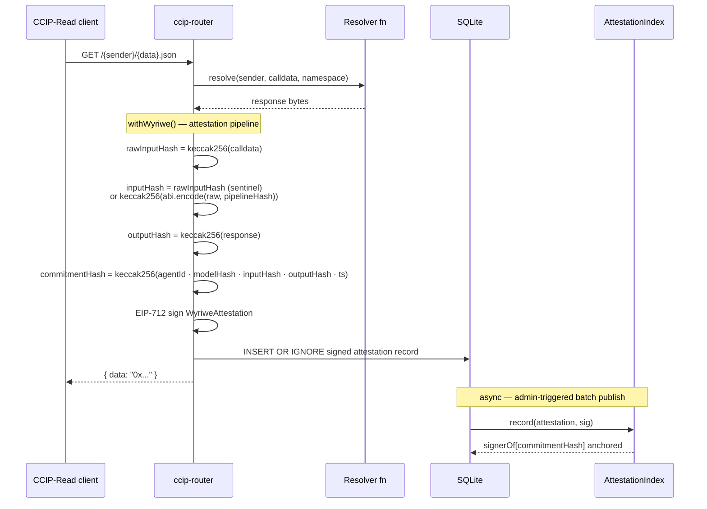
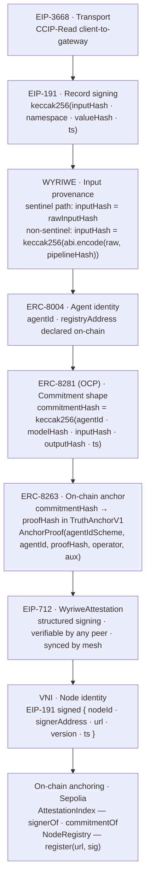

# ccip-router

**The coordination layer CCIP-Read was missing.**

EIP-3668 defines how clients talk to CCIP-Read gateways. It says nothing about how gateways talk to each other. `ccip-router` fills that gap — peer sync, deduplication, signed records, and cryptographic attestation for any CCIP-Read gateway.

No ENS required. No agents required. Any CCIP-Read project can plug in a resolver and get a mesh-ready gateway in minutes.

**→ [Integration guide](GUIDE.md)** — install, quickstart, attestation setup, contracts, mesh join.

**📋 The mesh sync protocol is now a draft Standards Track ERC** — *Gateway Mesh Sync Protocol for CCIP-Read* ([draft](https://gist.github.com/TMerlini/a079a712ef078cbbb5668e48428c91ad), `requires: 3668, 191`), discussion at [Ethereum Magicians #28680](https://ethereum-magicians.org/t/gateway-to-gateway-coordination-for-eip-3668-proposing-a-mesh-sync-protocol/28680). This repo is its reference implementation.

---

## Verify it yourself

Every record ccip-router serves is independently checkable from public data — you never have to trust a node.

**On-chain, trustless (no node in the loop).** The mesh's attestations recompute on Ethereum: call `verify(...)` on the live `WyriweProofVerifier` (Sepolia [`0x001eFFa0…DC96`](https://sepolia.etherscan.io/address/0x001eFFa0fD1D171b164808644678F3301d8EDC96#code)) — it recomputes the ERC-8281 / OCP commitment and recovers the signer entirely on-chain, **no external calls**. A `true` means the attestation is genuine; nothing here asks you to take its word.

**Off-chain (one request).** Ask any mesh node for the signed proof of a record and check the signature yourself:

```bash
curl https://<node>/verify/<inputHash>
# → { verified, signer, signingType, signature, attestation } — recover the EIP-712 signer offline and compare
```

**Mesh-recompute — a *different* node re-derives the verdict (non-self-attested).** Don't trust the issuing gateway's verdict — ask a peer to recompute it from its **own** RPC. `GET /recompute/binding` re-derives an agent's source-token live-ownership (the composition-note Step-1 3-case sovereignty check: `ownerOf(source)` ∈ {agent holder, canonical ERC-6551 TBA, binding contract}) and returns its independent verdict, stamped with which node computed it:

```bash
curl "https://<node>/recompute/binding?registry=0x..&agentId=N&source=0x..&sourceId=M&chainId=1"
# → { status: valid|invalid|unverifiable, matchedCase, sourceOwner, agentHolder, recomputedBy: { node, signer } }
```

The issuing gateway can fan this out to peers and report consensus — *"my verdict, confirmed by N independent nodes, 0 dissent."* Because the verdict derives only from public on-chain state, anyone recomputes it; the answer to *"if it's owned by no one, why trust this node?"* is *"you don't — here's a different node deriving the same result from its own reads."*

Full detail: [Verify mesh sync](#verify-mesh-sync) · [contracts](#contracts).

---

## What you can build

ccip-router is a general-purpose CCIP-Read gateway. The resolver function is yours — the mesh, signing, and attestation pipeline come wired up around it.

**ENS name resolution**
Point an ENS `wildcard` or `offchainLookup` resolver at your gateway. ccip-router handles the EIP-3668 `/{sender}/{data}.json` endpoint, signs every response, and replicates it to peer nodes — so your ENS names stay live even if one gateway goes down.

**Native full web3 dapps**
Pin your app's pages as IPFS CIDs and set them as the ENS contenthash — the frontend has no server to take down. Serve dynamic data through ccip-router: any node in the mesh can answer a CCIP-Read request, so if one goes offline the others keep the app running. The ENS name ties both layers together on-chain. The result is a dapp with no single point of failure at either the frontend or the data layer.

**Off-chain data for on-chain contracts**
Any smart contract that uses `OffchainLookup` can delegate reads to ccip-router. Store token metadata, user profiles, game state, or permit trees off-chain and serve them through a verifiable gateway rather than a trusted API.

**Audit trail for AI agents**
Wrap an AI inference function with `withWyriwe()`. Every call gets a cryptographic receipt: what input the agent received, what model processed it, what it returned — EIP-712 signed and replicated across the mesh. Useful anywhere you need a tamper-evident log of AI output (legal, compliance, multi-agent workflows).

**Model Context Protocol (MCP) gateway**
Run ccip-router as the transport layer for an MCP server. Tool calls arrive as CCIP-Read requests; attestations prove what the model saw and returned. Any peer can verify a past call without trusting your node.

**Redundant resolver mesh**
Run the same namespace across multiple nodes. Records sync every five minutes over `GET /records`. If one node goes offline its records are already on the others — no single point of failure, no custom failover logic.

**Any verifiable off-chain lookup**
If your contract needs off-chain data and you want proof it wasn't tampered with, ccip-router gives you the signed record, the peer-replicated history, and an optional on-chain anchor — all from a single resolver function.

---

## Architecture

### System overview


### Per-request attestation flow



### Attestation stack



---

## Contracts

All ccip-router contracts are permissionless — no owner, no admin. One deployment per chain serves all nodes.

| Contract | Sepolia address | Purpose |
|---|---|---|
| `AttestationIndex` | [`0x107D706112225aC57eCf6692FBbDC283fb6E3698`](https://sepolia.etherscan.io/address/0x107D706112225aC57eCf6692FBbDC283fb6E3698) | ccip-router's ERC-8281 (OCP)-compatible commitment store. Stores `signerOf[commitmentHash]` and `commitmentOf[inputHash]`. Valid ERC-8281 anchor — distinct from the ERC-8263 canonical contract. |
| `NodeRegistry` | [`0x6be4966596A9CBaa7260ab6EbbFFA69bBC9a42b7`](https://sepolia.etherscan.io/address/0x6be4966596A9CBaa7260ab6EbbFFA69bBC9a42b7) | Public directory of nodes. `register(url, sig)` proves key ownership via EIP-191 — the relayer (`msg.sender`) does not need to be the signing key. |
| `WyriweProofVerifier` | [`0x001eFFa0fD1D171b164808644678F3301d8EDC96`](https://sepolia.etherscan.io/address/0x001eFFa0fD1D171b164808644678F3301d8EDC96#code) | ERC-8274 `IProofVerifier` implementation. `verify(inputHash, outputHash, abi.encode(agentId, registry), abi.encode(modelHash, rawInputHash, sanitizationPipelineHash, commitmentHash, timestamp, sig))` — recomputes ERC-8281 (OCP) commitment, recovers signer, returns bool. No external calls. |
| `WyriweAttestationVerifier` *(deprecated)* | [`0x9515D6e53D2D45C1CFE6181943ca11C150C2bf61`](https://sepolia.etherscan.io/address/0x9515D6e53D2D45C1CFE6181943ca11C150C2bf61) | ERC-8183 `IAttestationVerifier`. Superseded by `WyriweProofVerifier`. |
| `CommitRevealSettler` (V1) | [`0xc972F18CaD3c58F754ad24a977C46463B368411a`](https://sepolia.etherscan.io/address/0xc972F18CaD3c58F754ad24a977C46463B368411a#code) | ERC-8275 Layer 2 on-chain settlement (no bonds). Superseded by V2. |
| `CommitRevealSettlerV2` | [`0x3001a91418c6aA75daD4093AC9e57277e2c81eDC`](https://sepolia.etherscan.io/address/0x3001a91418c6aA75daD4093AC9e57277e2c81eDC#code) | ERC-8275 Layer 2 — bond/slash settlement. Adds `BOND_AMOUNT` (0.01 ETH) at commit (Router+Hybrid only via NodeRegistryV2), `REVEAL_WINDOW` (48h), `CHALLENGE_PERIOD` (7d), `slashUnrevealed()`, and `challenge(periodId, nodeAddress, bytes4 proofType, bytes proofData)`. Slash recipient: `EscrowV1` (`0x18165265aDBA40054792929D89c6C487Ae2242E9`). |
| `GenericCommitRevealSettler` | [`0xFe7Ab6d95f7567a311B98D029373d0fc1511aCCe`](https://sepolia.etherscan.io/address/0xFe7Ab6d95f7567a311B98D029373d0fc1511aCCe#code) | Bytes-generic commit/reveal primitive. Accepts any record type — contribution snapshots, judgment attestations (WYRIWE L4), OCP observations. No NodeType gate or bond. `commitmentHash = keccak256(abi.encode(record, periodId, committer))`. Schema discrimination is off-chain via EIP-712 type strings. |
| `NodeRegistryV2` *(pending group sign-off)* | [`0xeFae266aE0a74518da320a029dD76F4d47e2a87b`](https://sepolia.etherscan.io/address/0xeFae266aE0a74518da320a029dD76F4d47e2a87b#code) | ERC-8275 node registry extended with `enum NodeType { Origin, Router, Hybrid }`. `EscrowV1` reads `nodeType` at settlement time to route payouts to the correct reward pool. Breaking change to `NodeRegistry.register()` — bundled with next mainnet contract revision pending group sign-off. |
| `EscrowV1` | [`0x18165265aDBA40054792929D89c6C487Ae2242E9`](https://sepolia.etherscan.io/address/0x18165265aDBA40054792929D89c6C487Ae2242E9#code) | ERC-8275 trust-minimized escrow. `createOrder` locks ETH or ERC-20; `confirmOrder` releases to agent; `disputeOrder` freezes funds; `resolveDispute` (arbitrator: 0=refund, 1=release, 2=split); `refundExpiredOrder` permissionless after deadline. Accumulates `CommitRevealSettlerV2` slash proceeds in `slashPool` via `receive()`. `agentId = bytes32(uint160(agentAddress))` — NodeRegistryV2-compatible. |

**ERC-8263 canonical reference contract** (Vincent Wu, not ccip-router):

| Contract | Sepolia | Mainnet |
|---|---|---|
| `TruthAnchorV1` | [`0x89EE9b68c3b2f50cbE9D0fC4Dc134939a0475c1C`](https://sepolia.etherscan.io/address/0x89EE9b68c3b2f50cbE9D0fC4Dc134939a0475c1C) | [`0xe95d6a15966984c209a62a2c188828555eb5ec3d`](https://etherscan.io/address/0xe95d6a15966984c209a62a2c188828555eb5ec3d) |

`TruthAnchorV1` emits the canonical `AnchorProof(uint8 agentIdScheme, bytes32 agentId, bytes32 proofHash, address operator, bytes aux)` event that ERC-8281 (OCP)'s ERC-8263 extraction rule is written against. `AttestationIndex` sits alongside it as the transport-layer commitment store — the two are separate primitives by design.

**How ccip-router connects to ERC-8263:** ccip-router anchors its `commitmentHash` as the `proofHash` in `TruthAnchorV1`. ERC-8263's `proofHash` is deliberately opaque — the same anchor layer serves OCP, WYRIWE, and zkML uniformly. ccip-router's `commitmentHash = keccak256(abi.encode(agentId, modelHash, inputHash, outputHash, timestamp))` is one canonical instantiation of it, not the definition. Full chain: inference runs → gateway signs `WyriweAttestation` (producing `commitmentHash`) → `anchor(commitmentHash)` called on `TruthAnchorV1` as the `proofHash` → `AnchorProof` event emitted. To verify L3 anchoring, filter `AnchorProof` by the `proofHash` topic (= your `commitmentHash`) and compare the anchoring block's timestamp against your execution time. V1 is event-only by design (no per-anchor storage cost). A synchronous on-chain view (`IAnchorReader`) is proposed for ERC-8263 v0.3.

To activate: set `TRUTH_ANCHOR_ADDRESS` to the appropriate network address (see env vars table). The admin panel spec audit card for ERC-8263 shows `⚠ Partial` when WYRIWE is active but `TRUTH_ANCHOR_ADDRESS` is not yet configured, and `✓ Pass` once both are live. The publish toast also reports how many `AnchorProof` events were emitted alongside the `AttestationIndex` count.

Deployed by [`0xFf9a176577Fb42b6bc9c19fd05a241e8fCd0ca14`](https://sepolia.etherscan.io/address/0xFf9a176577Fb42b6bc9c19fd05a241e8fCd0ca14) · Solc 0.8.24 · optimizer 200 runs.

### Mainnet contracts

| Contract | Mainnet address |
|---|---|
| `NodeRegistry` | [`0x95a1e10D1508EF5CD11e3F4d296359c93f15e48D`](https://etherscan.io/address/0x95a1e10D1508EF5CD11e3F4d296359c93f15e48D) |
| `AttestationIndex` | [`0xc7BCCD785Fb994e570d0ca10D0F7899d87C82210`](https://etherscan.io/address/0xc7BCCD785Fb994e570d0ca10D0F7899d87C82210) |
| `WyriweProofVerifier` | [`0xd8a09d830b27697e1b24e8c9800e562d20318a09`](https://etherscan.io/address/0xd8a09d830b27697e1b24e8c9800e562d20318a09) |

Nodes register their URL by signing `keccak256("ccip-router:node:" + url)` with their signing key. The relayer (`msg.sender`) can differ from the signing key — no ETH required in the hot key. Four nodes are currently registered: NAS (`0x58766f90...`), Railway primary (`0x2048eADf...`), ENS Boiler (`0x85Fa1351...`), and Damon's node (`0x5e4F655f...`).

Set `NODE_REGISTRY=0x95a1e10D1508EF5CD11e3F4d296359c93f15e48D` on any mainnet node to enable on-chain registration via `POST /admin/api/register`.

**ERC-8004 identity via NodeRegistry:** Set `AGENT_ID` to your node's signer address padded to bytes32, `REGISTRY_ADDRESS` to the NodeRegistry address, and `MODEL_HASH` to `keccak256("ccip-router:<name>:<nodeUrl>")`. This gives each router node its own verifiable infrastructure identity — distinct from user-level ERC-8004 agent tokens.

```env
# NAS node example
NODE_REGISTRY=0x95a1e10D1508EF5CD11e3F4d296359c93f15e48D
AGENT_ID=0x00000000000000000000000058766f90ede2419feafd97c28bb0f0ddf951dc54
REGISTRY_ADDRESS=0x95a1e10D1508EF5CD11e3F4d296359c93f15e48D
MODEL_HASH=0x80d4afd92fa6918f6e3bf706d19b2680301e5015cf5c46ecf7f6b178cfd660fc
```

### OffchainResolver v2 — Mainnet

EIP-3668 wildcard resolver with multi-signer support. Replaces the single `signerAddress` pattern with `mapping(address => bool) authorizedSigners` so any node in the mesh can sign a valid CCIP-Read response.

| Contract | Mainnet address |
|---|---|
| `OffchainResolver` v2 | [`0xB300e09e6C4f901409B809e7924CF68A2A429014`](https://etherscan.io/address/0xB300e09e6C4f901409B809e7924CF68A2A429014) |

`dinamic.eth` is pointed at this contract. Four signers are authorized — one per active mesh node (router or gateway). If any node is down the ENS client falls back to the next URL automatically.

Source: [`contracts/OffchainResolver.sol`](contracts/OffchainResolver.sol)

**To use on Mainnet or Sepolia:** open the admin panel → Deploy contracts → select the chain → "Use these addresses →". Canonical addresses are saved to config automatically, no deployment needed.

**To deploy to another chain:** open the admin panel → Deploy contracts → select the chain → connect wallet → three transactions (one per contract). No private key is stored — MetaMask signs everything in-browser.

Source: [`contracts/AttestationIndex.sol`](contracts/AttestationIndex.sol) · [`contracts/NodeRegistry.sol`](contracts/NodeRegistry.sol) · [`contracts/NodeRegistryV2.sol`](contracts/NodeRegistryV2.sol) · [`contracts/CommitRevealSettler.sol`](contracts/CommitRevealSettler.sol) · [`contracts/CommitRevealSettlerV2.sol`](contracts/CommitRevealSettlerV2.sol) · [`contracts/GenericCommitRevealSettler.sol`](contracts/GenericCommitRevealSettler.sol) · [`contracts/EscrowV1.sol`](contracts/EscrowV1.sol) · [`contracts/IAgentEscrow.sol`](contracts/IAgentEscrow.sol) · [`contracts/IProofVerifier.sol`](contracts/IProofVerifier.sol) · [`contracts/WyriweProofVerifier.sol`](contracts/WyriweProofVerifier.sol)

---

## Two tiers

### Basic — plug in a resolver, get a gateway + mesh

```typescript
import { CcipRouter } from 'ccip-router'

const ccip = new CcipRouter({
  namespace: 'token-metadata',
  db,
  gatewayKey: process.env.GATEWAY_PRIVATE_KEY,
  resolver: async (sender, calldata, namespace) => {
    return encodeMyResponse(calldata)
  },
})

app.route('/', ccip.hono())
```

What you get:
- CCIP-Read handler (`/{sender}/{data}.json`)
- EIP-191 signed records written to SQLite on every call
- Mesh peer sync (`GET /records?since=&namespace=&limit=&cursor=`)
- Record deduplication — same `inputHash` never inserted twice
- Admin dashboard at `/admin` with peer management + sync controls
- Setup wizard at `/setup` on first boot

### ENS — built-in wildcard resolver

`withEns()` decodes `resolve(bytes name, bytes data)` calldata (EIP-137 wildcard pattern), dispatches to a clean handler, and ABI-encodes the response. DNS wire-format, selector dispatch, and null-to-zero-value fallbacks are handled for you.

```typescript
import { CcipRouter, withEns } from 'ccip-router'
import type { EnsResolverFn } from 'ccip-router'

const resolver: EnsResolverFn = async (name, record) => {
  // name   → "vitalik.eth"
  // record → { type: 'addr' } | { type: 'addr', coinType: 60n }
  //           { type: 'text', key: 'avatar' } | { type: 'contenthash' }
  return db.lookup(name, record) // return string or null
}

const ccip = new CcipRouter({
  namespace: 'ens-offchain',
  db,
  gatewayKey: process.env.GATEWAY_PRIVATE_KEY,
  resolver: withEns(resolver),
})
```

**Standalone mode:** ENS records are managed from the admin panel ("ENS Records" panel — no code required). Any name pointing to this gateway via an on-chain CCIP-Read wildcard resolver is served automatically.

**Compose with attestation:**
```typescript
resolver: withWyriwe(withEns(resolver), attestationOpts)
```

Use `isEnsCalldata(calldata)` to safely gate `withEns()` in a multi-purpose resolver that also handles non-ENS calldata.

---

### Advanced — wrap any resolver with WYRIWE EIP-712 attestation

```typescript
import { CcipRouter, withWyriwe } from 'ccip-router'

const ccip = new CcipRouter({
  namespace: 'agent-attestations',
  db,
  gatewayKey: config.gatewayKey,
  resolver: withWyriwe(myAgentResolver, {
    gatewayKey:       config.gatewayKey,
    registryAddress:  process.env.REGISTRY_ADDRESS as `0x${string}`,
    agentId:          process.env.AGENT_ID as `0x${string}`,
    modelHash:        process.env.MODEL_HASH as `0x${string}`,
    chainId:          1,
    // sanitizationCID: 'ipfs://Qm...',  // omit for sentinel (identity) path
  }),
})
```

What `withWyriwe()` adds on top of basic:
- Triple-hash chain — two paths:
  - **Sentinel** (default): `sanitizationPipelineHash = keccak256("IDENTITY_SENTINEL")`, `inputHash = rawInputHash`
  - **Non-sentinel** (`sanitizationCID` set): `sanitizationPipelineHash = keccak256(CID)`, `inputHash = keccak256(abi.encode(rawInputHash, sanitizationPipelineHash))`
- EIP-712 `WyriweAttestation` signed with the gateway key on every resolver call
- Attestation records persisted to `{namespace}:wyriwe` — synced by the mesh automatically
- Verifiable by any peer: recover signer from signature, match against known gateway address

---

## Node modes

ccip-router runs in two modes — any combination can form a mesh.

| Mode | Description | Typical host |
|---|---|---|
| **Operator node** | Admin dashboard, signing key, ENS records, attestation pipeline | Self-hosted (Docker / VPS / home server) |
| **Public node** | Mesh sync + CCIP-Read serving only. No admin surface, no key UI. Set `DISABLE_ADMIN=true` | Any PaaS (Railway, Fly, Render) |

Both modes use the same Docker image and npm package. The difference is configuration only.

**→ [Full deployment guide](DEPLOYMENT.md)** — self-hosted operator setup, Railway one-click public node, reverse proxy config, Cloudflare Tunnel, multi-URL resolver, key generation, security notes.

[](https://railway.com/template/ccip-router)

### Node roles in the mesh

The `/health` endpoint and admin peers panel report a `role` field for every node in the mesh:

| Role | Badge | Detection | Description |
|---|---|---|---|
| **router** | 🔵 blue | `nodeVersion` matches semver (`\d+\.\d+`) | Full ccip-router node — peer sync, admin dashboard, attestation pipeline |
| **gateway** | 🟣 purple | `nodeVersion` is non-semver (e.g. `"ens-boiler"`) | Third-party gateway implementing `GET /records` — participates in mesh sync without running ccip-router |
| **unknown** | ⬛ grey | `nodeVersion` is null | Version not yet discovered — role resolved on next sync tick |

Any CCIP-Read gateway that exposes `GET /records` in the mesh protocol format becomes a **gateway** peer. Router nodes pull its records exactly as they pull from other router nodes — fully heterogeneous mesh.

---

## Live network (dinamic.eth)

Four nodes serving `dinamic.eth` via [`OffchainResolver v2`](https://etherscan.io/address/0xB300e09e6C4f901409B809e7924CF68A2A429014), forming a **bidirectional heterogeneous mesh**:

| Node | Role | URL | Signer | Tiers |
|---|---|---|---|---|
| ENS Boiler | 🟣 gateway node | `https://gateway.ensub.org/lookup/{sender}/{data}` | `0x85Fa1351…` | signed, erc8004, wyriwe, erc8281, vni, onChain |
| NAS node | 🔵 router node | `https://gateway.gen-plasma.com/{sender}/{data}` | `0x58766f90…` | signed, erc8004, wyriwe, erc8281, vni, onChain |
| Railway node | 🔵 router node | `https://ccip-router-production.up.railway.app/{sender}/{data}` | `0x2048eADf…` | signed, erc8004, wyriwe, erc8281, vni, onChain |
| Damon's node | 🔵 router node | `https://ccip-router-production-3506.up.railway.app/{sender}/{data}` | `0x5e4F655f…` | signed, erc8004, vni, onChain |

ENS Boiler runs [ens-dynamic-kit](https://github.com/Echo-Merlini/ens-dynamic-kit) — a separate gateway stack. It participates in the mesh as a **gateway** peer: it exposes `GET /records` in the ccip-router mesh protocol, so router nodes pull its attestation records on every sync tick. All nodes sync bidirectionally — records originating on any node propagate to all others within one sync interval.

All registered signers are authorized on the mainnet resolver. ENS clients try URLs in order — any live node produces a verifiable response.

All four nodes are registered in the mainnet [`NodeRegistry`](https://etherscan.io/address/0x95a1e10D1508EF5CD11e3F4d296359c93f15e48D). Each node's ERC-8004 identity uses its signer address as `agentId` — infrastructure identity, not a user-level NFT agent.

**Mesh resilience in practice:** during a Railway SG3 storage outage (June 2026), the primary Railway node went offline entirely. The NAS node continued serving all 35 records with all 6 tiers green throughout the outage. The sync cron logged Railway as unreachable on every cycle and moved on — no manual intervention, no record loss, no downtime on the namespace. Railway came back and the mesh re-synced automatically. A single CCIP-Read gateway has no fallback; the mesh keeps serving as long as one node is up.

---

## Live proof — ERC-8299 in production

The first end-to-end cross-stack trace using the ERCs this repo implements ran on **12 June 2026**.

**Ledger entry 23** — [`api.babyblueviper.com/ledger/23`](https://api.babyblueviper.com/ledger/23)

**The trail:**

| Step | Layer | Detail |
|---|---|---|
| Identity | ERC-8004 | PGA #14 (tokenId 14 in dinamic.eth dynamic registry, mainnet `ownerOf` checkable) |
| Judgment | ERC-8299 (WYRIWE) | Triple-hash: `rawProposalHash → verdictHash → executedActionHash`. Verdict: `approve_with_concerns` (0.85). Verdict timestamp strictly before execution timestamp. |
| Execution | Agent-to-agent bus | Action executed as judged — receipts on-chain |
| Anchor | ERC-8263 | Entry 23 verdict event id anchored in `TruthAnchorV1` as an opaque `proofHash` — mainnet `0xe95d6a15…ec3d`, tx [`0xc75e2950…6090`](https://etherscan.io/tx/0xc75e295083c57411eafe99916c511908cfee3ef510067c1353749455711a6090), block 25308037 |

The ERC-8299 triple-hash chain (`rawProposalHash → verdictHash → executedActionHash`) maps directly to `withWyriwe()`'s sentinel path in this repo. The spec is at [ethereum/ERCs#1810](https://github.com/ethereum/ERCs/pull/1810).

All four legs are now on-chain — identity → judgment → anchor closes end to end, with the relay-attested verdict ~19h before the anchor block (two independent timestamp authorities on one verdict).

---

## Quick start (setup wizard)

```bash
npm install
npm run dev
# → open http://localhost:3000/setup
# → step 1: generate or import your signing key
# → step 2: optional Bearer secret for CLI access
# → step 3: namespace, port, sync interval
# → step 4: confirm → config.json written, node restarts
# → /admin/login: connect any MetaMask wallet → first signer claims admin
# → /admin: dashboard ready
```

Or configure via environment (no wizard needed):

```bash
cp .env.example .env
# set GATEWAY_PRIVATE_KEY, ADMIN_SECRET, PEERS, etc.
npm run dev
```

---

## Environment variables

> **Security:** never put `GATEWAY_PRIVATE_KEY` or other secrets inline in a compose file. Use `env_file:` pointing to a `chmod 600` file, or your platform's secrets UI (Railway Variables, Fly secrets, etc.). See [DEPLOYMENT.md](DEPLOYMENT.md) for the recommended pattern.

| Variable | Required | Default | Description |
|---|---|---|---|
| `GATEWAY_PRIVATE_KEY` | Yes* | — | 32-byte hex signing key (`0x...`). Without it the node runs in dry-run mode (unsigned records). |
| `ADMIN_SECRET` | No | — | Protects `/admin`. Set for any non-local deployment. Without it the dashboard is open. |
| `ADMIN_ADDRESS` | No** | — | Ethereum address of the admin wallet. Locks admin permanently — survives restarts, overrides `config.json`. **Required on stateless deployments (Railway, Fly, Render).** |
| `PORT` | No | `3000` | HTTP port |
| `DB_PATH` | No | `./data.db` | SQLite file path |
| `SYNC_NAMESPACE` | No | `agent-attestations` | Record namespace — peers must match |
| `SYNC_INTERVAL` | No | `*/5 * * * *` | Cron expression for peer sync |
| `PEERS` | No | — | Comma-separated peer URLs |
| `AGENT_ID` | No | — | ERC-8004 agent identity (bytes32 hex). Enables `/identity` endpoint. |
| `REGISTRY_ADDRESS` | No | — | ERC-8004 on-chain registry address. Required alongside `AGENT_ID`. |
| `CHAIN_ID` | No | `1` | Chain where the ERC-8004 registry is deployed. |
| `ATTESTATION_INDEX` | No | — | Deployed `AttestationIndex` contract address. Enables on-chain anchoring. |
| `NODE_REGISTRY` | No | — | Deployed `NodeRegistry` contract address. Enables on-chain node registration. |
| `NODE_REGISTRY_V2` | No | — | Deployed `NodeRegistryV2` contract address. Uses `NodeType` enum for register and discover. Falls back to `NODE_REGISTRY` if unset. |
| `NODE_TYPE` | No | `1` | Node type for `NodeRegistryV2` registration: `0`=Origin, `1`=Router (default), `2`=Hybrid. Origin nodes do not participate in settlement quorum. |
| `RPC_URL` | No | — | JSON-RPC endpoint. Required alongside `ATTESTATION_INDEX`. |
| `MODEL_HASH` | No | — | `keccak256` of model weights CID. Required to activate WYRIWE attestation. |
| `NODE_URL` | No | — | This node's public URL. Required for VNI (signed node identity). |
| `AUTO_DISCOVER` | No | `true` | Pull peer lists from synced peers automatically. |
| `CDN_PROVIDER` | No | — | `pinata` or `storacha`. Enables IPFS upload from admin panel. |
| `CDN_API_KEY` | No | — | API key / JWT for the configured CDN provider. |
| `NETWORK_KEY` | No | — | Ethereum address. Messages signed by this key are marked as official network announcements. |
| `DISABLE_ADMIN` | No | `false` | Set `true` to skip mounting `/admin` and `/static` entirely. Recommended for public PaaS nodes. |
| `RESOLVER_ADDRESS` | No | — | Deployed `OffchainResolver` contract (informational — shown in spec audit). |
| `TRUTH_ANCHOR_ADDRESS` | No | — | ERC-8263 `TruthAnchorV1` contract address. When set, fires `anchorWithAux()` after every `AttestationIndex.record()` — emits `AnchorProof` with the `commitmentHash` as `proofHash`. Mainnet: `0xe95d6a15966984c209a62a2c188828555eb5ec3d`. Best-effort; does not affect `AttestationIndex` anchoring on failure. |

\* Can also come from `config.json` written by the setup wizard.
\** Optional on persistent deployments; required on stateless ones — see [Self-hosted vs stateless](#self-hosted-vs-stateless-deployments) below.

---

## Self-hosted vs stateless deployments

The admin authentication model differs depending on whether your deployment has a persistent filesystem.

### Self-hosted (NAS, VPS, home server, Docker with a volume)

`config.json` survives restarts. Admin is claimed on first login via SIWE and the address is written to disk — it persists across reboots.

```env
GATEWAY_PRIVATE_KEY=0x...   # required
ADMIN_SECRET=...            # recommended — Bearer fallback for CLI / scripts
# ADMIN_ADDRESS not needed — claimed via browser wallet on first login
```

Flow: boot node → visit `/admin/login` → connect MetaMask → first wallet to sign claims admin permanently. Transfer admin via the dashboard if you need to change it later.

### Stateless / centralized (Railway, Fly, Render, any PaaS)

The container filesystem is ephemeral — `config.json` is wiped on every redeploy. Without `ADMIN_ADDRESS` set, the node returns to unclaimed state after every restart and the first wallet to visit `/admin/login` claims admin.

**Set `ADMIN_ADDRESS` in your platform's environment variables UI to lock admin permanently:**

```env
GATEWAY_PRIVATE_KEY=0x...           # required — use platform secrets UI, not inline
ADMIN_SECRET=...                    # required — no filesystem to protect with file perms
ADMIN_ADDRESS=0x<your-wallet>       # required — locks admin across all redeploys
```

`ADMIN_ADDRESS` takes precedence over `config.json` and is immutable at runtime — `setAdminAddress` and the SIWE reset endpoint are both no-ops when this env var is present. To change the admin wallet, update the env var in your platform dashboard and redeploy.

**Recovery:** if you get locked out (wrong wallet in MetaMask, or session lost after restart), the login page shows the expected wallet address with a copy button. On a session reset (restart), just reconnect with the correct wallet. If you've genuinely lost access, update `ADMIN_ADDRESS` in the platform dashboard — no SSH required.

> On Railway: set `ADMIN_ADDRESS`, `GATEWAY_PRIVATE_KEY`, and `ADMIN_SECRET` in the Variables tab. Use Railway's secret injection — never put keys inline in a Dockerfile or `railway.json`.

---

## Admin dashboard

Visit `/admin` after setup. Features:
- Live stats: record count, peer count, last sync time
- Peer panel: add/remove peers, per-peer health + signer address + last sync
- Recent records panel: local vs peer-synced, timestamps
- ENS records panel — add/edit/delete addr, text, contenthash records without a restart
- Manual sync trigger
- Auto-refresh every 15 seconds

**Peer discovery:** The peers panel has a **⊕ Discover** button that queries the on-chain `NodeRegistry` and lists all registered nodes not yet added as peers — with live health checks and one-click connect. Requires `NODE_REGISTRY` or `REGISTRY_ADDRESS` and `RPC_URL` to be configured.

**Join Requests:** New nodes that want to join the mesh can post a signed join request to `POST /join-request` on any known node. The admin panel shows pending requests in a **Join Requests** panel (polled every 30 s, red badge when pending). Approve → MetaMask → calls `NodeRegistry.register(url, sig)` on-chain. Decline drops the request. The on-chain registry remains permissionless — this is soft governance on top of it. See [Joining the mesh](#joining-the-mesh) below.

**IPFS & browser resolution:** The IPFS panel supports an optional **Resolver address** field. Leave blank to use the ENS Public Resolver; fill in a custom address to target any resolver that implements `setContenthash(bytes32 node, bytes hash)` — e.g. a CCIP-Read resolver like `dinamic.eth`.

**Header role badge:** A **ROUTER** / **GATEWAY** / **UNKNOWN** badge in the top-right header shows this node's role derived from its version string — same colour scheme as the peers panel badges.

**Auth — claim on first login (EIP-4361 SIWE):** On a fresh node the login page shows an amber "Unclaimed node" banner. Connect any browser wallet and sign once — that wallet address is saved to `config.json` as the permanent admin. Subsequent logins must match that address. Admin wallet is completely decoupled from the gateway signing key (`GATEWAY_PRIVATE_KEY` stays server-side).

> On stateless deployments (Railway, Fly, etc.), set `ADMIN_ADDRESS` as an env var instead — `config.json` is wiped on every restart. See [Self-hosted vs stateless](#self-hosted-vs-stateless-deployments).

**Transfer admin:** While logged in, open the "Admin wallet" panel → Transfer. Switch MetaMask to the new wallet, sign a transfer message to prove ownership — `adminAddress` is updated live and a new session is issued, no restart required.

**Wrong wallet / locked out:** The login page shows the expected wallet address with a copy button and a "switch wallet" instruction. If you need to recover without the correct wallet, enter your `ADMIN_SECRET` in the recovery section — this calls `POST /admin/siwe/reset` to clear `adminAddress` back to unclaimed state. Disabled when `ADMIN_ADDRESS` is set via env var (update the env var in your platform dashboard instead).

**Bearer fallback:** `Authorization: Bearer <ADMIN_SECRET>` always works for CLI / scripts regardless of SIWE state.

**Stack status row:** A compact pill row below the header shows which tiers are active — Signing / ERC-8004 / WYRIWE / ERC-8281 / ERC-8263 / VNI / On-chain — derived from `/admin/api/status`. Green = active, grey = unconfigured.

**Node logs panel:** Live ring buffer of the last 200 log lines (info/warn/error), colour-coded. Auto-refreshes every 10 seconds.

---

## Two-node local test

Uses Hardhat dev keys — safe for local testing only, **never use in production**.

### Option A — two terminals

**Terminal 1 — node A**
```bash
PORT=3001 DB_PATH=./node-a.db \
  GATEWAY_PRIVATE_KEY=0xac0974bec39a17e36ba4a6b4d238ff944bacb478cbed5efcae784d7bf4f2ff80 \
  PEERS=http://localhost:3002 SYNC_INTERVAL="*/1 * * * *" \
  npm run dev
```

**Terminal 2 — node B**
```bash
PORT=3002 DB_PATH=./node-b.db \
  GATEWAY_PRIVATE_KEY=0x59c6995e998f97a5a0044966f0945389dc9e86dae88c7a8412f4603b6b78690d \
  PEERS=http://localhost:3001 SYNC_INTERVAL="*/1 * * * *" \
  npm run dev
```

### Option B — Docker

```bash
docker compose up --build
```

### Verify mesh sync

```bash
# trigger a CCIP call on node A — writes a signed record
curl http://localhost:3001/0xf39Fd6e51aad88F6F4ce6aB8827279cffFb92266/0xdeadbeef

# check node A recorded it
curl http://localhost:3001/health | jq .records  # → 1

# wait ~1 minute for sync cron, then check node B
curl http://localhost:3002/health | jq .records  # → 1 (synced from A)

# verify by inputHash on node B
curl http://localhost:3002/verify/<inputHash>
```

---

## API reference

### CCIP-Read handler
```
GET /{sender}/{data}.json
→ { data: "0x..." }        EIP-3668 response
```

### Mesh sync (any peer can pull this)
```
GET /records?namespace=<str>&since=<unix>&limit=<n>&cursor=<str>
→ {
    protocol: 1,
    node_version: "0.2.0",
    namespace: "agent-attestations",
    records: [{ inputHash, namespace, key, value, timestamp, signature, sourcePeer }],
    cursor: "<next>" | null
  }
```

### ERC-8281 (OCP) observation commitment (ERC-8263)
```
GET /ocp/:inputHash
→ {
    inputHash,
    found: true,
    commitmentHash: "0x...",
    observation: { agentId, modelHash, inputHash, outputHash, timestamp },
    namespace, sourcePeer
  }
→ { inputHash, found: false }   (404 — no WYRIWE attestation for this inputHash)
```

### Attestation lookup
```
GET /verify/:inputHash
→ {
    inputHash,
    found: true,
    proofs: [
      {
        namespace:   "agent-attestations",
        signingType: "EIP-191",
        verified:    true,
        signer:      "0x...",
        signature:   "0x...",
        timestamp:   1234567890,
        sourcePeer:  null | "https://..."
      },
      {
        namespace:   "agent-attestations:wyriwe",
        signingType: "EIP-712 WyriweAttestation",
        verified:    true,
        signer:      "0x...",
        signature:   "0x...",
        timestamp:   1234567890,
        attestation: { agentId, registry, modelHash, rawInputHash,
                       sanitizationPipelineHash, inputHash, outputHash }
      }
    ]
  }
→ { inputHash, found: false }   (404)
```

### Identity (ERC-8004)
```
GET /identity
→ { declared: true, agentId, registryAddress, chainId, namespace, signerAddress }
→ { declared: false }   (404 — AGENT_ID not configured)
```

### Node identity (VNI)
```
GET /vni
→ { nodeId, signerAddress, url, version, timestamp, signature }
→ { declared: false }   (404 — NODE_URL not configured)
```

### Peer gossip
```
GET /peers
→ { protocol: 1, node_version, signerAddress, peers: [{ url, signerAddress, healthy, lastSyncAt }] }
```

### Contributions (ERC-8275 Layer 1 + 2)
```
GET /contributions
→ { namespace, contributions: [{ source, records }] }

GET /contributions/snapshot?period=N
→ { periodId, snapshotCutoff, frozenAt, rowCount, snapshotRoot, commitmentHash, nodeAddress, status }

POST /contributions/snapshot/freeze
{ "periodId": "N", "epochClose": "<unix_ts>" }   // epochClose optional; freeze triggers if now >= epochClose - 600s
→ snapshot (frozen) | { status: "pending", snapshotCutoff, now }
```
 — rows sorted by contributor address ascending.
 — binds snapshot to period and node, prevents cross-node replay.
Freeze is idempotent. Status lifecycle: `pending -> frozen -> committed -> revealed`.

**On-chain settlement (Sepolia):** after freeze, call `CommitRevealSettler.submitCommit(periodId, commitmentHash)` using the `commitmentHash` from the freeze response, then `submitReveal(periodId, rows[])` to verify on-chain.
CommitRevealSettlerV2: [`0x3001a91418c6aA75daD4093AC9e57277e2c81eDC`](https://sepolia.etherscan.io/address/0x3001a91418c6aA75daD4093AC9e57277e2c81eDC#code) (Sepolia, verified) — requires 0.01 ETH bond at `submitCommit`, Router+Hybrid nodes only; slash recipient: EscrowV1

### Join request (new node onboarding)
```
POST /join-request
  body: { url: string, signature: string }
  signature: personal_sign of keccak256("ccip-router:node:" + url) with the node's gateway key
  → { ok: true, id, signerAddress }   (stored as pending, visible in admin panel)
  → { error }                          (invalid signature, unreachable URL, etc.)
```

### Health
```
GET /health
→ {
    ok, version, role: "router",
    namespace, signerAddress,
    identity: { agentId, registryAddress, chainId } | null,
    tiers: { signed, erc8004, wyriwe, ocp, vni, onChain },
    peers: [{ url, healthy, nodeVersion, role, signerAddress, lastSyncAt }],
    records, ensRecords
  }
```

`role` is `"router"` for ccip-router nodes. Gateway peers report the role derived from their `nodeVersion` field: semver → `"router"`, non-semver → `"gateway"`, unknown → `"unknown"`.

### Admin auth (SIWE + Bearer)
```
GET  /admin/siwe/nonce          → { nonce, domain, chainId, authorizedAddress, claimed }
POST /admin/siwe/verify         { message, signature }
                                  unclaimed node → first caller claims admin, saved to config.json
                                  claimed node   → must match stored adminAddress
                                  → { ok, address, claimed, redirect }
POST /admin/siwe/transfer       { message, signature } — signed by NEW wallet
                                  current session required; updates adminAddress live
                                  → { ok, address }
POST /admin/siwe/reset          { secret } — no session required
                                  clears adminAddress → unclaimed state (recovery without SSH)
                                  requires ADMIN_SECRET; no-op if ADMIN_ADDRESS env var is set
                                  → { ok, message } | { error }
POST /admin/logout              clear session cookie
```

### Admin API (requires auth)
```
GET  /admin/api/status          node info, peers, recent records, tiers, adminAddress
GET  /admin/api/logs            last 200 log lines [{ ts, level, msg }]
GET  /admin/api/audit           per-spec compliance report (EIP-3668/WYRIWE/ERC-8004/ERC-8281/ERC-8263/VNI)
POST /admin/api/sync            trigger immediate peer sync
POST /admin/api/publish         batch-publish recent WYRIWE records to AttestationIndex
                                  body: { limit?: number }  (default 50, max 200)
                                  → { published, skipped, errors }
POST /admin/api/peers           { url } — add peer
DEL  /admin/api/peers           { url } — remove peer
GET  /admin/api/ens-records     ?name= — list ENS records
POST /admin/api/ens-records     { name, type, coinType?, textKey?, value } — upsert
DEL  /admin/api/ens-records     { name, type, coinType?, textKey? } — delete
GET  /admin/api/config          safe config snapshot (never exposes private key)
POST /admin/api/config          update config fields → writes config.json, restarts node
POST /admin/api/key             { gatewayKey } — rotate signing key → restart
POST /admin/api/register        register node on-chain via NodeRegistry
GET  /admin/api/peers/discover  query NodeRegistry for registered nodes not yet added as peers
                                  → { nodes: [{ url, signerAddress, healthy, role, version, alreadyPeer }] }
                                  requires NODE_REGISTRY (or REGISTRY_ADDRESS) + RPC_URL
GET  /admin/api/join-requests   list join requests  ?status=pending|approved|declined (default: pending)
                                  → { requests: [{ id, url, signerAddress, status, healthOk, healthData, createdAt }] }
GET  /admin/api/join-requests/:id/calldata
                                  encode NodeRegistry.register(url, sig) for MetaMask
                                  → { to, data, chainId }
POST /admin/api/join-requests/:id/approve   mark as approved (call after MetaMask tx sent)
POST /admin/api/join-requests/:id/decline   mark as declined, hide from pending list
```

---

## Joining the mesh

Any node can request to join by posting a signed message to an existing node. No ETH required — the existing node's admin submits the on-chain registration tx.

```bash
# 1. Generate the signature (sign keccak256("ccip-router:node:" + url) with your gateway key)
node -e "
const { keccak256, toBytes } = require('viem')
const { privateKeyToAccount } = require('viem/accounts')
const url = 'https://my-node.example.com'
const acc = privateKeyToAccount('0x<GATEWAY_PRIVATE_KEY>')
const hash = keccak256(toBytes('ccip-router:node:' + url))
acc.signMessage({ message: { raw: hash } }).then(sig => console.log(JSON.stringify({ url, signature: sig })))
"

# 2. POST to any known mesh node
curl -X POST https://ccip-router-production.up.railway.app/join-request \
  -H 'Content-Type: application/json' \
  -d '{"url":"https://my-node.example.com","signature":"0x..."}'
# → { "ok": true, "id": 1, "signerAddress": "0x..." }
```

The admin of any receiving node will see the request in their **Join Requests** panel. On approval, MetaMask submits `NodeRegistry.register(url, sig)` — the recovering the signer from the signature means any relayer can submit without ETH in your hot key.

**Soft governance caveat:** the on-chain `NodeRegistry.register()` is permissionless — any node can also call it directly, bypassing the request flow. Hard on-chain quorum enforcement (N-of-N approval gate) is planned for a future contract upgrade.

---

## Mesh sync protocol

Any CCIP-Read gateway implementing `/records` is mesh-compatible — ccip-router nodes pull from it exactly as they pull from other router nodes:

```
GET /records?since=<unix>&namespace=<string>&limit=<n>&cursor=<string>
→ { protocol: 1, node_version, namespace, records: [...], cursor: string | null }
```

Each record must be signed: `signature = signMessage({ raw: keccak256(encodePacked([bytes32, string, bytes32, uint64], [inputHash, namespace, keccak256(value), timestamp])) })`. The receiving node recovers the signer and pins it — subsequent records from the same peer must match the same key.

Protocol version `1` is the current stable spec. Nodes on a different version are skipped during sync with a warning.

**Namespaces** are application-defined and scoped at the record level:
- `agent-attestations` — base CCIP-Read response records
- `agent-attestations:wyriwe` — WYRIWE EIP-712 attestations (auto-produced by `withWyriwe()`)
- `token-metadata` — NFT gateways
- anything — define your own

**Economic attribution (`/contributions`):** every record carries a `sourcePeer` field. `GET /contributions` returns per-peer record counts for a namespace — the on-mesh accounting layer for usage-based incentive models. This is the substrate for a transactional compensation layer between nodes: operators whose records are consumed by peers can be rewarded proportionally via an escrow smart contract keyed to contribution counts.

---

## ERC / spec alignment

| Spec | Layer | Role | Status |
|---|---|---|---|
| EIP-3668 | Transport | CCIP-Read client-to-gateway | ✅ implemented |
| WYRIWE | L2 Input trust | Triple-hash commitment, EIP-712 attestation | ✅ implemented |
| ERC-8004 | L1 Identity | Agent identity `agentId` + `registryAddress` in attestation | ✅ implemented |
| ERC-8281 (OCP) | L3 Commitment shape | keccak envelope binding agent, model, input, output, timestamp. `AttestationIndex` = transport-layer store. `/ocp/:inputHash` endpoint. | ✅ implemented |
| ERC-8263 | L3 On-chain anchor | `commitmentHash` carried as `proofHash` in `TruthAnchorV1` (Vincent Wu), emitting `AnchorProof`. The same opaque anchor layer serves OCP, WYRIWE, and zkML uniformly. | ✅ implemented |
| EIP-712 | L4 Attestation | Structured signing (via `withWyriwe`) | ✅ implemented |
| VNI | L5 Node Identity | Signed node identity, peer gossip | ✅ implemented |
| ERC-8275 | L6 Economics | Contribution attribution + Layer 2 snapshot freeze + commitmentHash | ✅ implemented |

---

## Roadmap

### Done
- [x] CCIP-Read gateway (EIP-3668)
- [x] SQLite record store — WAL mode, composite PK `(inputHash, namespace)`, cursor pagination
- [x] DB versioned migrations (`schema_version` table, v1 applied on first boot)
- [x] EIP-191 signed records (basic tier)
- [x] Mesh peer sync with protocol version check
- [x] Setup wizard (`/setup`) — key generation, config.json persistence
- [x] Admin dashboard (`/admin`) — peers, records, sync
- [x] Admin auth — cookie session + Bearer token (`ADMIN_SECRET`)
- [x] `withWyriwe()` — EIP-712 attestation, triple-hash chain, IDENTITY_SENTINEL path
- [x] `/verify` — clean proof per namespace: `{ verified, signer, signingType, signature, attestation }`
- [x] ERC-8004 identity — `AGENT_ID` + `REGISTRY_ADDRESS` + `CHAIN_ID`, `/identity` endpoint, `/health` field
- [x] ERC-8281 (OCP) — `commitmentHash` in `WyriweAttestation`, `/ocp/:inputHash` endpoint
- [x] ERC-8263 — `commitmentHash` as `proofHash` in `TruthAnchorV1`, `AnchorProof` event anchor layer
- [x] Router SVG favicon, dinamic.eth design language
- [x] Peer signer pinning — reject records with unexpected signer after first sync
- [x] Peer health polling — fetch `/health` after every sync, populate `nodeVersion` + `signerAddress`
- [x] Graceful shutdown — `SIGTERM`/`SIGINT` → `server.close()` → `db.close()` → `process.exit(0)`
- [x] In-memory log ring buffer (200 lines, console-patched) → `/admin/api/logs` + colour-coded log panel
- [x] Stack status pills in admin header bar — Signing / ERC-8004 / WYRIWE / ERC-8281 / ERC-8263
- [x] Library re-export (`src/lib.ts`) — `CcipRouter`, `withWyriwe`, `IdentityOpts`, `WyriweOpts`, `ResolverFn`, DB types

- [x] `withWyriwe()` non-sentinel path — `sanitizationCID` option; `inputHash = keccak256(abi.encode(rawInputHash, sanitizationPipelineHash))`
- [x] Setup wizard reconfigure flow — pre-fills current config, "Keep existing key", `/setup/current-config` endpoint, inherited admin secret

- [x] Spec audit accordion panel in admin — per-spec cards (EIP-3668 / WYRIWE / ERC-8004 / ERC-8281 / ERC-8263), inline summary pills, expandable detail grid with missing-config hints
- [x] `contracts/AttestationIndex.sol` — on-chain anchor for WyriweAttestations; verifies EIP-712 sig against ERC-8004 registry domain, stores `signerOf[commitmentHash]` + `commitmentOf[inputHash]`
- [x] `src/chain/` — viem public + wallet clients, `publishAttestation()`, `checkOnChain()`
- [x] `/verify` on-chain fallback — if `inputHash` not in local DB and `ATTESTATION_INDEX` + `RPC_URL` configured, queries contract and returns on-chain proof
- [x] `POST /admin/api/publish` — batch-publish recent WYRIWE records to `AttestationIndex`; skips already-anchored; "Publish to chain" button in spec audit panel
- [x] Open node network — `GET /peers` gossip endpoint; auto-discovery pulls peer lists during sync (bounded at 10/cycle, disable with `AUTO_DISCOVER=false`)
- [x] VNI (Verifiable Node Identity) — `GET /vni` returns EIP-191 signed `{ nodeId, signerAddress, url, version, timestamp }`; peers verify during sync for authoritative signer resolution
- [x] `contracts/NodeRegistry.sol` — on-chain node directory; `register(url, sig)` proves key ownership; `POST /admin/api/register` + "Register on-chain" button in VNI spec card
- [x] ERC-8275 economics (MVP) — contribution attribution via `getContributions(namespace)`; `GET /contributions`; per-peer record counts surfaced in spec audit panel
- [x] ERC-8275 Layer 2 — snapshot freeze endpoints; snapshotRoot + commitmentHash per spec; idempotent, pre-cutoff guard, pending → frozen lifecycle; migration v6
- [x] Config: `NODE_URL`, `NODE_REGISTRY`, `AUTO_DISCOVER`; `/health` exposes `tiers.vni` + `tiers.onChain`

### Next — UI & node management

**Stack status bar**
- [x] Add VNI + On-chain tier pills
- [x] Click signer address pill to copy to clipboard (green flash feedback)

**Node info & layout**
- [x] Move node info bar above the peers/records panels; add namespace field
- [x] Toast-based error feedback in add-peer form (replaces `alert()`)

**Node config panel** *(in-dashboard, no env editing required)*
- [x] Full config panel — Core / Signing / Network / Identity / Chain / Admin sections
- [x] `GET /admin/api/config` — safe config snapshot (signer address, never the key)
- [x] `POST /admin/api/config` — writes `config.json`, preserves gateway key, restarts node
- [x] Auto-discover toggle, seed peers textarea, unsaved-changes indicator

**Wallet & signing**
- [x] Signing key panel — generate or import, rotate with identity-change warning, `POST /admin/api/key`
- [x] Dry-run banner — shown when no key configured, "Configure key →" scrolls to key panel

**Setup wizard — node owner onboarding**
- [x] Admin secret as dedicated step 2 — prominent warning box, two-step skip confirmation
- [x] Post-setup checklist — signing ✓, admin ✓/⚠, WYRIWE/ERC-8004/VNI ○ with next-step hints
- [x] Spawn-based node restart (setup + config save) — works without a process manager
- [x] Claim-on-first-login — first MetaMask wallet to sign becomes permanent admin, no pre-configuration required
- [x] Admin transfer — logged-in admin proves new wallet ownership via SIWE, `adminAddress` updated live with no restart
- [x] ENS records panel — live table, add/delete addr / text / addr_coin / contenthash records, changes take effect immediately
- [x] Admin wallet panel in dashboard — current address, two-step transfer UI
- [x] `withEns()` — ENS wildcard resolver wrapper; DNS wire-format decode, selector dispatch (addr / addr_coin / text / contenthash), null → zero-value fallbacks, `isEnsCalldata()` guard
- [x] `OffchainResolver.sol` v2 — multi-signer via `mapping(address => bool) authorizedSigners`; `addSigner` / `removeSigner`; deployed to mainnet (`0xB300e09e6C4f901409B809e7924CF68A2A429014`); dinamic.eth updated
- [x] Live 3-node mesh — ENS Boiler + NAS ccip-router + Railway ccip-router all authorized signers; any node can serve a verifiable CCIP-Read response
- [x] ENS Boiler dual-write sync — every admin record upsert also pushes to ccip-router via `ccipRouterSync.ts`
- [x] `RESOLVER_ADDRESS` config field — shown in spec audit panel
- [x] WyriweProofVerifier deployed to Ethereum mainnet (`0xd8a09d830b27697e1b24e8c9800e562d20318a09`) — ERC-8274 `IProofVerifier` parity with Sepolia
- [x] `KNOWN_DEPLOYMENTS` in admin panel includes Ethereum mainnet — one-click canonical contract setup for operators
- [x] All 3 mesh nodes registered in mainnet NodeRegistry with correct EIP-191 signing (relay pattern — no ETH required in hot key)
- [x] ROUTER / GATEWAY / UNKNOWN role badges in admin peers panel — derived from `nodeVersion` (semver → router, non-semver → gateway)
- [x] `/health` `role` field at node level and per-peer — exposes mesh topology to any client
- [x] `GET /records` on ENS Boiler (ens-dynamic-kit) — gateway nodes now participate bidirectionally; router nodes pull attestation records from gateway peers on every sync tick
- [x] Heterogeneous mesh — any stack implementing the `/records` protocol joins the mesh regardless of language or runtime
- [x] Peer discovery from NodeRegistry — "⊕ Discover" button in peers panel queries `NodeRegistry` on-chain and lists registered nodes not yet added, with health check + one-click connect
- [x] Role badge in admin header — ROUTER / GATEWAY / UNKNOWN derived from node's own version, replaces namespace pill
- [x] 4th mesh node registered on mainnet NodeRegistry — bidirectional sync verified
- [x] Peer discovery fall-through — `REGISTRY_ADDRESS` accepted as fallback when `NODE_REGISTRY` is unset
- [x] Join request flow — `POST /join-request` (public) + admin Join Requests panel; approve → MetaMask → `NodeRegistry.register()`; soft governance layer over permissionless registry
- [x] DB migration v4 — `join_requests` table (unique on `signer_address`, status lifecycle)
- [x] IPFS panel custom resolver field — optional; falls back to ENS Public Resolver; enables `setContenthash` on any CCIP-Read resolver (e.g. dinamic.eth)
- [x] Version panel update guidance — Watchtower / Docker / Railway / npm paths documented inline
- [x] Recent records panel spans full grid width; scrollbar transparent track
- [x] **v0.6.1** — `NodeRegistryV2` integration: `NODE_REGISTRY_V2` env var, `NODE_REGISTRY_V2_ABI` + `NodeType` enum in `abi.ts`, `registerNodeV2()`, `/api/register` branches on V2, `/api/peers/discover` reads 4-tuple `[signers, urls, nodeTypes, timestamps]`; `nodeType` in peer response; `CommitRevealSettlerV2` deployed Sepolia (`0x5e2e0007F5371e96035CFBab75d5d8db5875A267`) — bond/slash, Router+Hybrid gate; `GenericCommitRevealSettler` deployed Sepolia (`0xFe7Ab6d95f7567a311B98D029373d0fc1511aCCe`) — bytes-generic commit/reveal for WYRIWE L4, OCP, ERC-8275
- [x] **v0.6.2** — `NODE_TYPE` env var: nodes declare their own type for `NodeRegistryV2` registration (`0`=Origin, `1`=Router default, `2`=Hybrid), prevents Origin nodes registering as Router; CI always pushes `latest` tag to GHCR on branch push
- [x] **v0.6.3** — `EscrowV1` deployed Sepolia (`0x18165265aDBA40054792929D89c6C487Ae2242E9`, verified): ERC-8275 trust-minimized escrow — createOrder / confirmOrder / disputeOrder / resolveDispute / refundExpiredOrder; slash pool accumulator for `CommitRevealSettlerV2`; `IAgentEscrow` interface added
- [x] **v0.6.4** — ERC-8263 interop: `TRUTH_ANCHOR_ADDRESS` optional env var wires `TruthAnchorV1.anchorWithAux()` as a second anchor target alongside `AttestationIndex`; fires after every successful on-chain record, emitting `AnchorProof(agentIdScheme, agentId, commitmentHash, operator, aux)` with `aux=0x636369702d726f75746572` ("ccip-router"); best-effort (AttestationIndex anchor succeeds independently); `truthAnchorTxHash` returned in publish result

---

## Testing

The test suite uses the Node.js built-in test runner (`node:test`) with `tsx` for ESM TypeScript — no extra test framework required.

```bash
npm test
```

Expected output:

```
ℹ tests 61
ℹ suites 22
ℹ pass 61
ℹ fail 0
```

### What is tested

| File | Coverage |
|---|---|
| `src/__tests__/gateway.test.ts` | `decodeRequest` — address + calldata parsing, `.json` suffix stripping, `CcipRequestError` on bad inputs; `encodeResponse` envelope |
| `src/__tests__/crypto.test.ts` | `signRecord` / `recoverRecordSigner` round-trip; `verifyRecord` correct signer → `true`, wrong signer / tampered value → `false` |
| `src/__tests__/db.test.ts` | `insertRecord`, `getRecord` (with/without namespace), `getRecordsByInputHash`, `INSERT OR IGNORE` deduplication, cursor pagination, `getContributions` grouping, peer upsert + remove, ENS record upsert/delete/list |
| `src/__tests__/ocp.test.ts` | `buildCommitmentHash` determinism, 32-byte hex output, field-sensitivity (agentId / outputHash / timestamp) |
| `src/__tests__/wyriwe.test.ts` | Sentinel path (`inputHash === rawInputHash`), non-sentinel path (`keccak256(abi.encode(rawInputHash, sanitizationPipelineHash))`), paths produce distinct hashes for same calldata |
| `src/__tests__/vni.test.ts` | `makeVni` field shape + stable `nodeId`; `verifyVni` round-trip; tamper detection (url / signerAddress / nodeId → `null`) |
| `src/__tests__/ens.test.ts` | DNS wire-format encode/decode round-trip; `withEns()` dispatch for all 4 record types (addr, addr_coin, text, contenthash); null → zero-value fallbacks; unknown selector → `0x`; wrong outer selector throws |

Tests use `SQLiteDB(':memory:')` directly (bypassing the runtime singleton) and Hardhat dev key 0 for any signing operations — both are safe to commit and require no external services.

---

## Related

- [ens-boiler](https://github.com/Echo-Merlini/ens-boiler) — opinionated ENS agent stack built on `ccip-router`
- [WYRIWE](https://github.com/TMerlini/wyriwe) — input provenance spec
- [ERC-8281 (OCP)](https://github.com/damonzwicker/observation-commitment-protocol) — observation commitment protocol

---

**Author:** Tiago Merlini — [dinamic.eth](https://github.com/TMerlini)
**Co-authors:** Damon Zwicker (OCP / ERC-8281) · Vincent Wu (ERC-8263 / ERC-8004)
